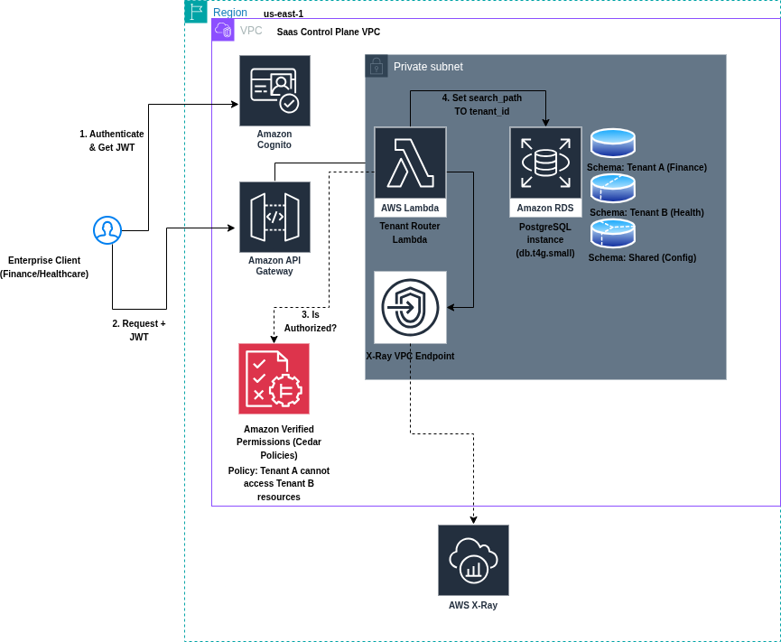
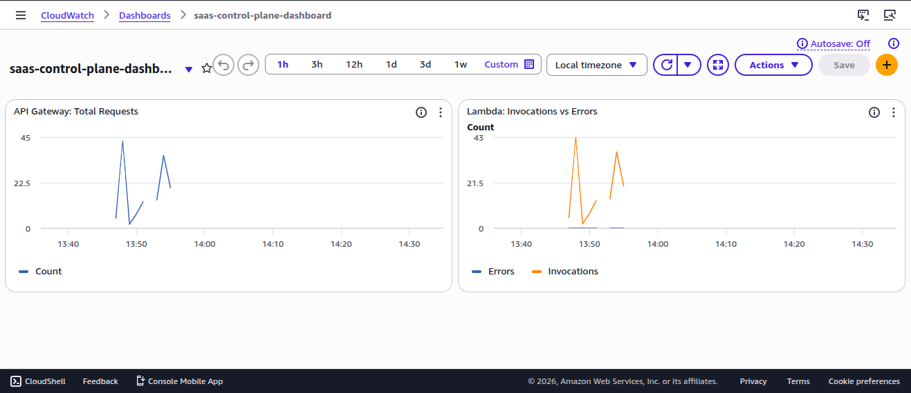

# Multi-Tenant SaaS Control Plane with Hard Data Isolation

## 1. The Business Problem
**Conflict:** A rapidly scaling B2B SaaS provider needs to onboard enterprise clients in regulated sectors (Finance & Healthcare).
* **The Constraint:** These clients mandate strict data isolation (no "cross-tenant spillage") and granualar audit logs.
* **The Problem:** The business cannot afford the operational overhead or cost of provisioning a dedicated database cluster for every single customer ("Instance-per-Tenant" model).


**The Solution:** An architecture that delivers the **compliance** of physical separation with the **economics** of shared infrastructure.

## 2. The Solution Architecture

### A. Identity & Access Management (The "Foundation")
* **Identity:** Amazon Cognito User Pools.
    * *Implementation:* Users are provisioned with a custom, immutable `tenant_id` attribute. This attribute is injected into the JWT ID Token, serving as the "Passport" for the session.
    * *Security:* Self-registration is disabled to prevent "Shadow IT".

* **Authorization:** Amazon Verified Permissions (AVP)
    * *Implentation:* We use the **Cedar** policy language to enforce "Zero Trust."
    * *Policy:* `permit (principal, action, resource) when { principal.tenant_id == resource.tenant_id };`
    * *Benefit:* Authorization logic is decoupled from application code, enabling independent security audits.

### B. Infrastructure & Governance
* **Infrastructure as Code:** 100% Terraform managed (`/infrastructure`).
* **FinOps:** automated AWS Budget alerts enforced via Terraform.
    * *Limit:* $25.00/month.
    * *Alerts:* 80% Actual Spend, 100% Forecasted Spend.

### C. Network Architecture (The Vault)
* **Design:** Custom VPC with strict Public/Private subnet separation.
* **Security:**
    * **Public Zone:** Contains the Application Load Balancer (ALB) and Bastion Host.
    * **Private Zone:** Houses the RDS Instance and Lambda Functions. **No Internet Gateway attachment.**

### D. Data Plane
* **Database:** Amazon RDS PostgreSQL (`db.t4g.micro`).
* **Security:**
    * **Network:** Deployed in Private Subnets (No internet access).
    * **Access Control:** Security Group allows traffic *only* from the VPC CIDR.
    * **Credentials:** Managed via AWS Secrets Manager (No hardcoded passwords).

### E. Operational Access
* **Bastion Host:** A t2.micro EC2 instance in the Public Subnet.
    * *Purpose:* distinct entry point for developers to run SQL migrations.
    * *Method:* SSH Tunneling maps `localhost:5433` -> `Bastion` -> `RDS:5432`.

## 3. Documentation
* [ADR-0001: Data Isolation Strategy](docs/adr/0001-database-isolation-strategy.md)
* [ADR-0002: Identity and Access Management Strategy](docs/adr/0002-identity-and-access-management.md)
* [ADR-0003: Netowrk Isolation Strategy](docs/adr/0003-network-isolation-strategy.md)
* [ADR-0004: Database and Secrets Management Strategy](docs/adr/0004-database-and-secrets-strategy.md)
* [ADR-0005: Bastion Host for Database Access](docs/adr/0005-bastion-host-access.md)
* [ADR-0006: Serverless Application Logic](docs/adr/0006-serverless-application-logic.md)
---

* 

## 4. Project Roadmap & Status
| Phase                     | Component                     | Tech Stack                  | Status                      |
|----------------------     |-------------------------------|-----------------------------|-----------------------------|
| **1. Foundation**         | Identity, Authz, Governance   | Cognito, Cedar, AWS Budgets | ✅ **Completed**            |
| **2. Networking**         | VPC, Subnets, Security Groups | AWS, VPC                    | ✅ **Completed**            |
| **3. Data Plane**         | Database, Schema Isolation    | RDS PostgreSQL              | ✅ **Infrastructure Ready** |
| **4. Operational Access** | Bastion Host (SSH Tunnel)     | EC2, Security Groups        | ✅ **Completed**            |
| **5. Schema Logic**       | Multi-Tenant Migration Scripts| Python/SQL                  | ✅ **Completed**            |
| **6. Control Plane**      | Request Routing               | API Gateway, Lambda, Python | ✅ **Completed**            |
| **7. Observability**      | CloudWatch Dashboard          | Terraform                   | ✅ **Completed**            |

---

## 4. Developer Guide: connecting to the Database

Since the database is private, you must open an SSH tunnel to connect.

**1. Get Connection Details:**
```bash
cd infrastructure
terraform output -json
```
Note the `bastion_public_ip` and `db_endpoint`

**2. Open the Tunnel**
Run this in a separate terminal window
```bash
ssh -i infrastructure/modules/bastion/bastion-key.pem \
    -L 5433:<RDS_ENDPOINT>:5432 \
    ec2-user@<BASTION_PUBLIC_IP> -N
```

**3. Connect**
Use your SQL client (DBeaver/pgAdmin) to connect to:
* **Host:** `localhost`
* **Port:** `5433`
* **User:** `dbadmin`
* **Password:** (Retrieve from AWS Secrets Manager)

## Proof of Concept: Live API Testing
This infrastructure is currently live. You can test the multi-tenant data isolation using the provided Postman collection.

1. Import the `postman_collection.json` file into Postman.
2. The collection hits the live AWS API Gateway endpoint.
3. Toggle the `x-tenant-id` header between `tenant_a` and `tenant_b` to observe the strict schema-level isolation enforced by the backend Lambda.

**Live Endpoint:** `https://nq66yc5ndk.execute-api.us-east-1.amazonaws.com`

## Day-2 Operations: Observability & Monitoring
A robust SaaS control plane requires deep visibility into traffic and errors. This infrastructure includes a fully automated AWS CloudWatch Dashboard provisioned via Terraform.

* **API Gateway Metrics:** Tracks total HTTP requests routed to the Control Plane.
* **Lambda Metrics:** Tracks function invocations and application-level errors (e.g., unauthorized tenant access attempts.)


